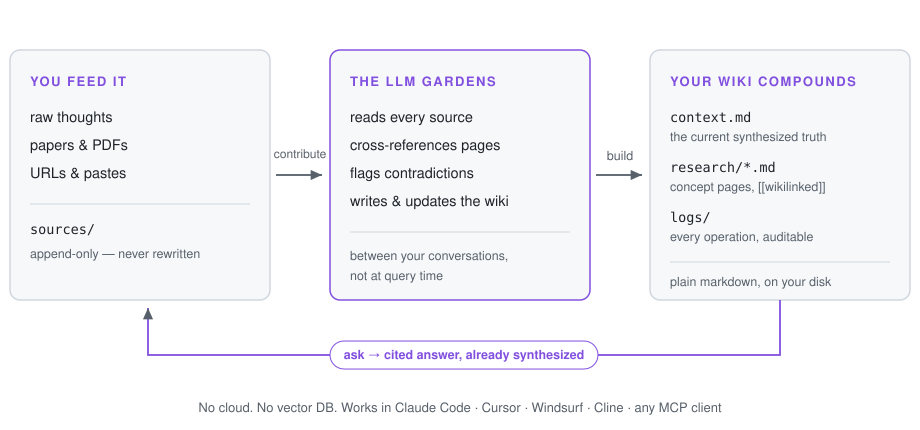
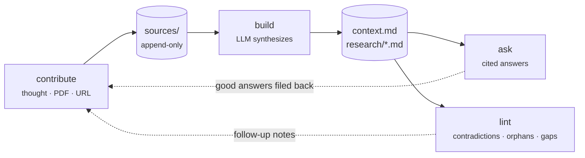
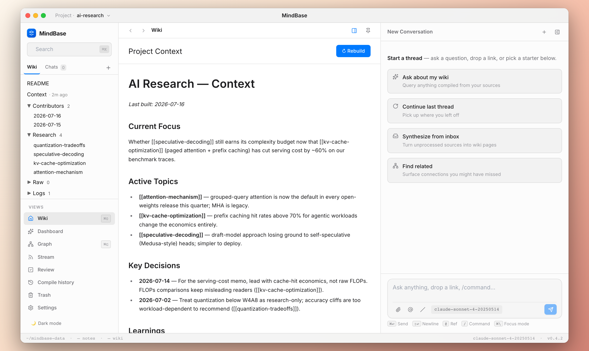
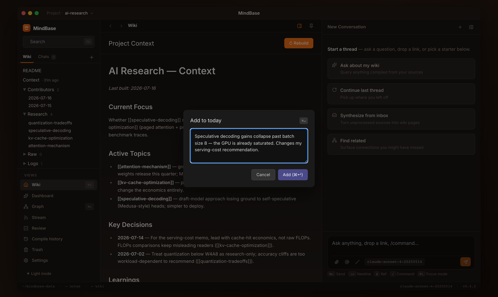

# MindBase

[](https://www.npmjs.com/package/mindbase-mcp)
[](https://www.npmjs.com/package/mindbase-mcp)
[](https://github.com/frankchu91/mindbase/actions)
[](https://github.com/frankchu91/mindbase/discussions)
[](LICENSE)

> **An AI research assistant that builds and maintains a wiki from your sources.** Not RAG-in-a-vector-DB. A real markdown wiki on your disk, that an LLM gardens for you between conversations.

MindBase implements Andrej Karpathy's [LLM-Wiki pattern](https://x.com/karpathy/status/1911080091498963196) as a product. You feed it sources (papers, articles, thoughts). The LLM reads, cross-references, flags contradictions, and writes structured wiki pages. Later, when you ask a question, the wiki already has the synthesized answer — no vector search re-derivation at query time.

<p align="center">
  <picture>
    <source media="(prefers-color-scheme: dark)" srcset="docs/assets/hero-dark.svg">
    
  </picture>
</p>

**Status:** Early access. Beta for feedback (2026-Q3). Data model + core loop stable; some UI features still in v1 → v2 migration.

---

## Table of contents

- [Why MindBase](#why-mindbase)
- [How it works (30 seconds)](#how-it-works-30-seconds)
- [What makes it different](#what-makes-it-different)
- [Prerequisites](#prerequisites)
- [Install — choose your AI editor](#install--choose-your-ai-editor)
  - [Claude Code (flagship experience)](#claude-code-flagship-experience)
  - [Cursor](#cursor)
  - [Windsurf](#windsurf)
  - [Cline (VSCode)](#cline-vscode)
  - [Continue.dev](#continuedev)
  - [Any other MCP-compatible client](#any-other-mcp-compatible-client)
- [First project (2 minutes)](#first-project-2-minutes)
- [Core workflows](#core-workflows)
- [Working with multiple projects](#working-with-multiple-projects)
- [Web UI (optional companion)](#web-ui-optional-companion)
- [Feature matrix by editor](#feature-matrix-by-editor)
- [Where your data lives](#where-your-data-lives)
- [Architecture at a glance](#architecture-at-a-glance)
- [Troubleshooting](#troubleshooting)
- [Roadmap](#roadmap)
- [Beta feedback](#beta-feedback)
- [License](#license)

---

## Why MindBase

You read a lot. Papers, articles, tweets, docs. You want to remember them, connect them, form opinions from them. Today you have two bad options:

- **Notion / Obsidian / Roam:** Passive containers. You do all the organizing. AI features are bolted-on generation, not maintenance.
- **NotebookLM / Perplexity Pages / ChatGPT search:** RAG-based. Nothing accumulates. Every question re-derives the answer from raw sources.

**MindBase is the third option:** the LLM actively maintains a persistent, structured wiki as you feed it sources. Knowledge compounds. Your `context.md` gets sharper every time you contribute. The AI *remembers you across sessions* because your beliefs are written down in markdown files — not stored in a chat history that gets summarized away.

Think of it as **a personal Wikipedia that an AI intern writes for you**, kept up to date, cross-referenced, and honest about what it doesn't know.

---

## How it works (30 seconds)

Three physical layers on disk (Karpathy's model):

```
Layer 1 — sources/          You add these. Append-only. LLM reads, never rewrites.
   ├─ contributors/          Your thoughts, dated per-user (like a lab notebook)
   ├─ research/              Wiki pages the LLM writes (concepts, entities, syntheses)
   └─ raw/                   PDFs, URL captures, pastes — original binaries

Layer 2 — README.md          The rules of your wiki. You edit. LLM reads at every op.
          context.md         The synthesized current truth. LLM writes. You read.
          index.yaml         Auto-generated file catalog. LLM maintains.

Layer 3 — logs/              Chronological log of every operation. LLM appends.
          artifacts/         Generated outputs: daily briefs, exports, lint reports.
```

Three operations the AI can run:

| Operation | What happens |
|---|---|
| **Contribute** | You feed a thought / PDF / URL. LLM reads, discusses key takeaways with you, updates 5-15 relevant wiki pages, appends log. |
| **Ask** | You ask a question. LLM reads your `context.md` first (already-synthesized truth), then drills into cited source pages. Cited answers with `[[wikilink]]` provenance. |
| **Lint** | LLM audits the whole wiki for contradictions, stale claims, orphan pages, missing cross-references, gaps that need investigation. |

They form a loop — good answers and lint findings flow back in as new contributions, so the wiki compounds:



That's the entire product. Everything else is UX.

---

## What makes it different

**vs. Notion:** You own the data (markdown files, not a proprietary DB). The AI is a **maintainer**, not a bolt-on generator. `context.md` evolves; Notion pages don't.

**vs. Obsidian:** You get the same local-first markdown vault, but with an AI that **actively writes** the wiki — you don't have to hand-craft every note. Comes with `[[wikilinks]]` cross-referencing done for you.

**vs. NotebookLM / Perplexity:** Knowledge **compounds**. Ask "what's my view on RAG?" and the answer already exists in `context.md`. NotebookLM re-derives it from raw sources every time — nothing accumulates.

**vs. any RAG tool:** RAG is stateless retrieval. MindBase is **stateful synthesis**. The wiki gets richer with every ingest. Answers get faster and more consistent over time.

---

## Prerequisites

- **Node.js 20+** (that's it for Cursor / Windsurf / Cline / Continue — the MCP server installs itself via `npx`)
- One of: Claude Code, Cursor, Windsurf, Cline, Continue.dev, or another MCP-compatible AI editor
- **pnpm 10+** only if you install the Claude Code plugin or the web UI from source
- (Optional) A modern browser, if you want the web UI

MindBase runs **entirely on your machine**. No cloud upload, no signup, no telemetry.

---

## Install — choose your AI editor

MindBase ships as an **MCP (Model Context Protocol) server** — published on npm as [`mindbase-mcp`](https://www.npmjs.com/package/mindbase-mcp). Every MCP-compatible AI editor can use its tools with a one-line config; no clone, no build. Claude Code gets an extra layer of polish (slash commands, sub-agents) via the plugin.

---

### Claude Code (flagship experience)

Get the full Karpathy 8-step ingest with sub-agents, slash commands, auto-context, and per-agent tool boundaries.

**Install the plugin** — two commands inside Claude Code, no clone, no build:

```
/plugin marketplace add frankchu91/mindbase
/plugin install mb@mindbase
```

Restart Claude Code when prompted. (The plugin launches its MCP server via `npx -y mindbase-mcp`, so npm delivers the server automatically.)

<details>
<summary>Developing the plugin from a clone?</summary>

```bash
git clone https://github.com/frankchu91/mindbase.git
cd mindbase && pnpm install
claude --plugin-dir apps/plugin
```

</details>

**Verify:** Open Claude Code, type `/`. You should see `/mb:contribute`, `/mb:ask`, `/mb:build`, `/mb:status`, and 8 others. Run `/mcp` — you should see `mb` connected with 49 tools.

**What you get:**
- 12 slash commands (`/mb:*`)
- 5 sub-agents with security boundaries (`contributor`, `builder`, `curator`, `researcher`, `migrator`) — each has a strict tool allowlist
- SessionStart hook — every new Claude Code session auto-injects your project's README + context + recent log entries
- The full Karpathy 8-step ingest: read → discuss takeaways → propose plan → wait for approval → execute

Skip to [First project](#first-project-2-minutes).

---

### Cursor

Add to `~/.cursor/mcp.json` (create the file if missing):

```json
{
  "mcpServers": {
    "mindbase": {
      "command": "npx",
      "args": ["-y", "mindbase-mcp"]
    }
  }
}
```

Restart Cursor. Open Cursor Chat → the tool picker should list `mindbase_contribute`, `mindbase_ask_wiki`, and 47 others.

**Optional but recommended:** teach Cursor's LLM about MindBase conventions by adding to `~/.cursor/rules.md` (or per-project `.cursorrules`):

```
# MindBase conventions

When the user mentions "mindbase", "mb", "my wiki", "记一下", or "记忆",
the following MCP tools are available: mindbase_contribute, mindbase_ask_wiki,
mindbase_status, mindbase_load_project, and more.

Rules:
1. When user says "add to mindbase X" or "记一下 X", ALWAYS call mindbase_contribute
   with text=X. Never just acknowledge without calling the tool.
2. When user says "ask mindbase X" or "问问我的 wiki", call mindbase_ask_wiki
   with query=X.
3. When ingesting a PDF/URL, follow the 8-step Karpathy loop:
   read → discuss 3 key takeaways with user → propose plan → wait for approval
   → then call mindbase_contribute with the summary.
4. Default project comes from config.json currentProjectId. If the user says
   "for project X" or "在 X 项目里", pass projectId=X to the tool call.
```

Skip to [First project](#first-project-2-minutes).

---

### Windsurf

Windsurf uses the same MCP config format. Open Cascade settings → MCP → add:

```json
{
  "mcpServers": {
    "mindbase": {
      "command": "npx",
      "args": ["-y", "mindbase-mcp"]
    }
  }
}
```

Restart Windsurf. Same rules-file approach as Cursor works — put a `MindBase conventions` block in your Cascade rules.

Skip to [First project](#first-project-2-minutes).

---

### Cline (VSCode)

Open VSCode → Cline extension settings → **MCP Servers**. Add:

```json
{
  "mcpServers": {
    "mindbase": {
      "command": "npx",
      "args": ["-y", "mindbase-mcp"]
    }
  }
}
```

Cline auto-detects. Every tool call gets a confirmation dialog by default (transparency win). Skip to [First project](#first-project-2-minutes).

---

### Continue.dev

Open `~/.continue/config.json`. Add under `experimental.modelContextProtocolServers`:

```json
{
  "experimental": {
    "modelContextProtocolServers": [
      {
        "transport": {
          "type": "stdio",
          "command": "npx",
          "args": ["-y", "mindbase-mcp"]
        }
      }
    ]
  }
}
```

Restart VSCode. In Continue chat, MCP tools appear under `@`. Skip to [First project](#first-project-2-minutes).

---

### Any other MCP-compatible client

If your editor supports MCP (Zed, Aider, Goose, ChatGPT Desktop's future MCP support, custom Claude Agent SDK apps), the pattern is identical: point it at

```
npx -y mindbase-mcp
```

as a stdio server. See your client's MCP docs for the exact config location.

---

## First project (2 minutes)

Once your editor has the MCP server connected, create your first project.

### Claude Code

```
/mb:init my-research --mission "Study transformer attention mechanisms"
```

Claude will scaffold `~/mindbase-data/projects/my-research/` with `README.md`, `context.md`, `index.yaml`, and empty `sources/`, `logs/`, `artifacts/` directories, and set it as your current project.

### Cursor / Windsurf / Cline / Continue

Type in chat:

```
Create a new mindbase project called my-research about transformer 
attention mechanisms.
```

The LLM will call `mindbase_init_project({ name: "my-research", mission: "..." })` and confirm.

### Verify

```
/mb:status              # in Claude Code
```

Or ask any other IDE:

```
what's the status of my mindbase?
```

You should see:

```
MindBase — Project: my-research
Location: ~/mindbase-data/projects/my-research

README     28 lines
context.md 8 lines  (last built: never)
index.yaml 5 lines

Contributors: 0 users, 0 entries
Sources:      0 research, 0 raw
Logs:         1 day
Artifacts:    0 outputs
```

You're ready.

---

## Core workflows

The four things you'll do every day.

### 1. Contribute a thought

Add a short observation, a decision, or a hot take. Goes straight into today's contributor file, no ceremony.

**Claude Code:**
```
/mb:contribute "Attention is basically a soft dictionary lookup — each query 
retrieves a weighted average of values based on similarity to keys."
```

**Any other IDE:**
```
Add to my mindbase: Attention is basically a soft dictionary lookup — each 
query retrieves a weighted average of values based on similarity to keys.
```

**Result:** appends to `~/mindbase-data/projects/my-research/sources/contributors/<you>/2026-07-11.md` and logs the operation.

### 2. Ingest a substantive source (paper, article, PDF)

For a real source, MindBase walks through Karpathy's 8-step ingest.

**Claude Code (flagship — with sub-agent):**
```
/mb:contribute /Downloads/attention-is-all-you-need.pdf
```

The `contributor` sub-agent will:
1. Read the PDF fully
2. Come back to you with 3 key takeaways
3. Propose which wiki pages to create/update
4. Wait for your approval
5. Execute — creating `sources/research/attention-mechanism.md`, updating `context.md`, appending log
6. Confirm: `✓ Created 4, updated 3, logged.`

**Any other IDE (lite mode — no sub-agent):**
```
Read this paper [/Downloads/paper.pdf] and ingest it into my mindbase. 
Walk me through the 3 key takeaways before committing anything.
```

You get most of the value but the sub-agent's structured approval flow is a Claude Code exclusive. The LLM in Cursor/Windsurf/Cline will typically call `mindbase_contribute` directly — you can steer the ritual manually via your prompt.

### 3. Ask your wiki

Query with cited answers.

**Claude Code:**
```
/mb:ask "how did I resolve the attention scaling factor question?"
```

**Any other IDE:**
```
Search my mindbase — how did I resolve the attention scaling factor question?
```

The LLM calls `mindbase_ask_wiki` (graph-aware retrieval: top hits + wikilink neighbors) then synthesizes a cited answer:

```
You resolved this on 2026-06-15 [context.md:42-51]. The 1/√d_k scaling 
prevents dot products from growing too large in high dimensions, which 
would push softmax into low-gradient regions [attention-mechanism.md:23-28].

Sources:
- [[context.md]]
- [[attention-mechanism.md]]
- [[sources/research/scaled-attention.md]]
```

### 4. Build (regenerate context.md)

After a few contributions, regenerate the curated `context.md` so it reflects your current thinking.

**Claude Code (flagship — with sub-agent):**
```
/mb:build
```

The `builder` sub-agent:
1. Validates project structure
2. Gathers all unbuilt sources since last build
3. Synthesizes them into a fresh `context.md`
4. Writes atomically (snapshots the old one first so you can rollback)
5. Rebuilds the index

**Any other IDE:**
```
Rebuild my mindbase context.md — synthesize all unbuilt sources.
```

The LLM will orchestrate the equivalent MCP tool calls. Slightly less structured than the sub-agent flow but functionally equivalent.

### 5. Health check (lint)

Ask MindBase to audit itself.

**Claude Code:**
```
/mb:lint
```

**Any other IDE:**
```
Run a health check on my mindbase — find contradictions, orphans, gaps.
```

Output looks like:

```
Found:
- 1 contradiction: attention-mechanism.md:15 says "scaling by √d" but 
  context.md:32 says "scaling by 1/√d". Same claim, different notation.
- 2 orphan pages: [[legacy-transformer-note]] and [[old-benchmark]] 
  have no inbound wikilinks.
- 1 gap: "positional encoding" is mentioned 4 times across the wiki 
  but has no dedicated page.
- 3 suggested cross-links: [[scaled-attention]] ↔ [[transformer-architecture]] 
  (co-mentioned in 3 sources).

Want to file follow-up notes for any of these?
```

---

## Working with multiple projects

You can have as many projects as you want (`ai-research`, `insurance`, `dissertation`). One is the "current" project — everything defaults to it. To switch, or to route a single operation to a specific project without switching, use flags.

### Switch current project

**Claude Code:**
```
/mb:load ai-research
```

**Any other IDE:**
```
Switch my mindbase to the ai-research project.
```

Writes `{"currentProjectId": "ai-research"}` to `~/mindbase-data/config.json`. Persists across sessions.

### One-off routing (`-p` flag) — Claude Code

Every command that takes a project supports `-p <project-id>` (or `--project <project-id>`):

```bash
/mb:contribute -p ai-agents "GPT-5 rumored 2026-Q4"
/mb:build -p insurance
/mb:ask -p ai-agents "my stance on agent marketplaces"
/mb:lint -p dissertation
/mb:daily-brief -p ai-agents --date 2026-07-05
```

The `-p` flag **does not change your current project**. It only routes this one operation.

### One-off routing — other IDEs

Just mention the project in natural language:

```
Add "GPT-5 rumored 2026-Q4" to my mindbase's ai-agents project.
```

The LLM passes `projectId: "ai-agents"` to the MCP tool call. Current project unchanged.

---

## Web UI (optional companion)

MindBase includes a browser-based viewer at `http://localhost:4321`. It's not required — the plugin/MCP path is the primary interface — but useful for **browsing** what the LLM has written.

<p align="center">
  
</p>

<p align="center">
  
</p>
<p align="center"><em><code>Cmd+I</code> from anywhere — a thought goes straight into today's contributor file. Dark mode included.</em></p>

### Start it

```bash
pnpm --filter @mindbase/server dev
# then open http://localhost:4321
```

You'll see:
- **LeftRail tree:** Contributors, Research, Logs, Artifacts, README, Context, Raw — organized as a file tree
- **Article view:** click any file to read it; edit inline
- **`Cmd+I` AddEntry:** quick capture that appends to today's contributor file (works in any browser tab)
- **Search (`Cmd+K`):** keyword search across your wiki
- **Project switcher:** dropdown at the top

What the Web UI **can't** do (yet):
- Run `/mb:ask`, `/mb:build`, `/mb:lint`, `/mb:research` — these need an LLM in the loop, which lives in your AI editor
- The Rebuild button in the Web UI just tells you to run `/mb:build` in Claude Code

Think of the Web UI as **a Finder for your wiki**, and your AI editor as **where you talk to it**.

---

## Feature matrix by editor

| Feature | Claude Code | Cursor / Windsurf / Cline / Continue | Web UI |
|---|---|---|---|
| Slash commands (`/mb:*`) | ✅ | ❌ (use natural language) | ❌ |
| MCP tools directly | ✅ | ✅ | ❌ |
| Karpathy 8-step ingest with sub-agents | ✅ | ⚠️ Manual (LLM won't auto-follow the ritual) | ❌ |
| Auto-context via SessionStart hook | ✅ | ✅ (Cursor supports MCP hooks) | N/A |
| Contribute short thought | ✅ | ✅ | ✅ (Cmd+I) |
| Ingest PDF / URL / paste | ✅ | ✅ | ❌ |
| Ask wiki with cited answers | ✅ | ✅ | ❌ (planned) |
| Build (regenerate `context.md`) | ✅ | ✅ | ⚠️ (button dispatches, but LLM runs elsewhere) |
| Health check / lint | ✅ | ✅ | ❌ (planned) |
| Deep research (web + wiki) | ✅ | ✅ | ❌ |
| Wiki tree browsing | ❌ | ❌ | ✅ |
| Rich file editor | ❌ | ❌ | ✅ |
| Cross-project search | ✅ | ✅ | ⚠️ (partial) |
| `-p project-id` routing flag | ✅ | ⚠️ (via natural language) | N/A |

**Legend:** ✅ works · ⚠️ partial / experimental · ❌ not yet

---

## Where your data lives

Everything is under `~/mindbase-data/` (override with `MINDBASE_DATA_DIR` env var).

```
~/mindbase-data/
├── config.json                       # { currentProjectId, ... }
└── projects/
    └── my-research/
        ├── README.md                 # Ops manual — you edit, LLM reads
        ├── context.md                # Synthesized truth — LLM writes, you read
        ├── index.yaml                # Auto-generated catalog
        ├── sources/
        │   ├── contributors/         # Your dated entries (append-only)
        │   │   └── <you>/
        │   │       └── 2026-07-11.md
        │   ├── research/             # LLM-authored wiki pages
        │   │   └── attention-mechanism.md
        │   └── raw/                  # PDFs, HTML captures, binary sources
        │       └── 2026-07-11/
        │           └── paper.pdf
        ├── logs/                     # Chronological operation log
        │   └── 2026-07-11.md
        ├── artifacts/                # Generated outputs
        │   ├── briefs/               # Daily briefs
        │   ├── exports/              # Bundle exports
        │   └── attachments/          # Images pasted into notes
        └── state/                    # LLM working state
            └── builder/snapshots/    # context.md snapshots for rollback
```

- **Everything is markdown.** Open in vim, VSCode, Obsidian — all work.
- **No proprietary database.** No SQLite of secret sauce. What you see on disk is what MindBase knows.
- **Git-friendly.** `cd ~/mindbase-data && git init` — every change auditable and rollbackable.
- **Delete freely.** `rm -rf ~/mindbase-data/projects/foo` — nothing else needs cleanup.

Backups: if you use iCloud / Time Machine / Dropbox, they'll pick this up automatically since it's just files.

---

## Architecture at a glance

```
       ┌────────────────────────────────────────────┐
       │  Your AI editor (any MCP-compatible):      │
       │  Claude Code · Cursor · Windsurf · Cline · │
       │  Continue.dev · Zed · Aider · ...          │
       └───────────────────┬────────────────────────┘
                           │  MCP (stdio JSON-RPC)
                           ▼
       ┌────────────────────────────────────────────┐
       │       MindBase MCP server (Node.js)        │
       │       — 49 tools: contribute, ask_wiki,    │
       │         build, lint, research, ...         │
       │       — reads/writes ~/mindbase-data/      │
       └───────────────────┬────────────────────────┘
                           │  file I/O
                           ▼
       ┌────────────────────────────────────────────┐
       │        ~/mindbase-data/projects/…          │
       │        Your markdown wiki on disk          │
       └───────────────────┬────────────────────────┘
                           │  read-only http
                           ▼  (optional)
       ┌────────────────────────────────────────────┐
       │  Web UI at localhost:4321 (React + Vite)   │
       │  Tree browser, editor, Cmd+I add-entry     │
       └────────────────────────────────────────────┘
```

- **`packages/core`** — TypeScript strict library; storage adapters, LLM adapters, wiki index, graph, compile pipeline
- **`apps/mcp`** — MCP server (JSON-RPC over stdio); tools + prompts; framework-agnostic
- **`apps/server`** — Express server; serves the Web UI + `/api/tree/*` REST endpoints
- **`apps/web`** — React 19 + Zustand + Tailwind frontend
- **`apps/plugin`** — Claude Code plugin bundle (slash commands + sub-agents + hooks + bundled MCP server)

---

## Troubleshooting

### "MCP server not connected"

Cause: malformed config JSON, or the server binary can't start.

Fix:
1. Run it manually: `npx -y mindbase-mcp < /dev/null` — should print `[mindbase-mcp] connected · dataDir=…` on stderr and exit 0.
2. If that works, the issue is in your editor's config (typo, wrong file, trailing comma).
3. Claude Code plugin users: verify the bundle exists — `ls /path/to/mindbase/apps/plugin/mcp-server/dist/cli.js` — and rebuild with `pnpm --filter @mindbase/plugin build` if missing.
4. Restart your editor after fixing config.

### "No current project"

Cause: You haven't run `/mb:init` yet, or `config.json` is missing `currentProjectId`.

Fix:
```
/mb:init my-first-project
```

Or manually: `echo '{"currentProjectId": "my-project"}' > ~/mindbase-data/config.json`

### "V1_LAYOUT_UNSUPPORTED"

Cause: you have a legacy v1 project directory (from before the 2026-06 refactor).

Fix (Claude Code only):
```
/mb:migrate --project <legacy-project-name>
```

Or delete it and start fresh: `rm -rf ~/mindbase-data/projects/<legacy-project-name>` then `/mb:init`.

### Tools don't show in autocomplete

Cause: MCP handshake didn't complete.

Fix: Restart your editor. Check that no other MCP server is failing (a crash in one can block others in some clients).

### The LLM in Cursor/Windsurf ignores my "add to mindbase" request

Cause: the LLM didn't recognize the intent as a tool call opportunity.

Fix: Add the `.cursorrules` block from the [Cursor](#cursor) section. Being explicit ("call mindbase_contribute with text=...") works too.

### "/api/counts 404" in Web UI

Cause: a pre-existing server-side route gap. Non-blocking — some tab count badges show 0 until fixed.

Fix: known issue, coming in the next patch release. Track it on the [issues page](https://github.com/frankchu91/mindbase/issues).

### More issues

Open a GitHub issue: [github.com/frankchu91/mindbase/issues](https://github.com/frankchu91/mindbase/issues)

---

## Roadmap

**Now (2026-Q3 beta):**
- Multi-editor MCP support ✅
- Karpathy 8-step ingest via sub-agents (Claude Code) ✅
- Cross-project routing (`-p` flag) ✅
- Web UI tree browser + Cmd+I add-entry ✅
- Wiki v2 layout ✅

**Next (Q4):**
- Web UI `Ask` panel (skip Claude Code roundtrip for queries)
- Web UI `Lint` cards (visual health check inbox)
- Audio input via Whisper (`/mb:contribute --audio recording.m4a`)
- Browser extension for one-click "save this page to MindBase"
- Anthropic marketplace listing (`/plugin install mindbase@mindbase-official`)
- `mindbase_command` unified meta-tool (slash-like UX in Cursor/Windsurf)

**Later:**
- Team brain (multi-contributor projects with human-in-the-loop review)
- Audio Overview (NotebookLM-style podcast digests)
- Marp slide-deck answers
- Tauri desktop app (one-click install for non-technical users)
- Mobile quick-capture apps

---

## Beta feedback

I'm running MindBase as a private beta through 2026-Q4. If you're using it:

- **Bug reports / feature requests:** [github.com/frankchu91/mindbase/issues](https://github.com/frankchu91/mindbase/issues)
- **Direct feedback / 30-min interview:** [haobing0304@gmail.com](mailto:haobing0304@gmail.com)

I read every issue and reply within 24 hours during beta. If you tried MindBase and gave up — please tell me why. The blockers you hit are gold.

**What kind of feedback is most useful?**
- What happened the first minute after install?
- Which command / workflow do you use every day, if any?
- Which command / workflow did you try once and never again?
- What did you expect to work that didn't?
- What broke your trust in the LLM's synthesis?
- Would you pay for this? What's the shape of the pricing that would feel fair?

---

## License

[MIT](LICENSE) — do what you want, no warranty. If you build something interesting on top, I'd love to hear about it.

---

**Built with the belief that AI's most valuable gift is not "generation on demand" but "gardening of a persistent artifact you own."**
